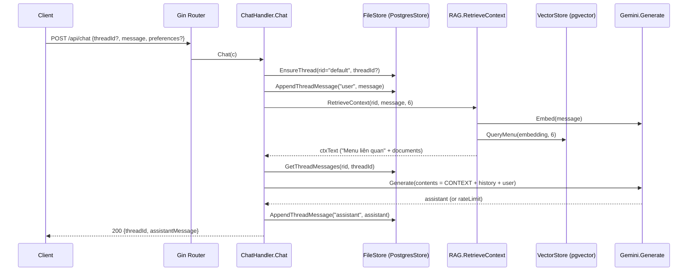

# Chat flow (backend.golang)

Tài liệu này mô tả **luồng xử lý chat end-to-end** của service Go (Gin) trong thư mục `chatbot/backend.golang`.

Phạm vi:
- Từ lúc nhận `POST /api/chat` đến lúc trả response.
- Cách tạo/ghi lịch sử hội thoại.
- Cách lấy RAG context (restaurant + menu liên quan) từ DB/vector.
- Cách gọi LLM Gemini và xử lý rate-limit.

## 1) Routing & entrypoint

- Router đăng ký endpoint ở: `internal/httpserver/router.go`
  - `POST /api/chat` → `handlers.ChatHandler.Chat`

Services được inject vào handler:
- `FileStore` (lưu threads/messages, CRUD menu, restaurant info)
- `RAG` (lấy context)
- `Gemini` (LLM)

Các contract/type alias liên quan:
- `internal/httpserver/handlers/contracts.go` (alias về `internal/core`)
- `internal/core/contracts.go`

## 2) Request/response schema

Handler parse JSON body trong `internal/httpserver/handlers/chat.go`:

```go
// request
{
  "threadId": "..." | null,
  "message": "...",
  "preferences": { ... } | null
}

// response
{
  "threadId": "...",
  "assistantMessage": "..."
}
```

Ghi chú:
- `threadId` nếu không truyền sẽ tạo thread mới.
- `preferences` hiện được **đính kèm vào prompt** (dạng JSON) để LLM dùng khi trả lời.

## 3) Tenant / restaurantID

Hiện runtime là single-tenant.
- `internal/httpserver/handlers/tenant.go`: `RestaurantID(c)` luôn trả về hằng `"default"`.

Tuy DB/schema vẫn giữ `restaurant_id` để future-proof.

## 4) Luồng xử lý trong `ChatHandler.Chat`

File: `internal/httpserver/handlers/chat.go`

### Bước 1 — Bind request

```go
var req chatRequest
if err := c.ShouldBindJSON(&req); err != nil {
  400
}
```

### Bước 2 — Resolve threadId + restaurantId

- `threadID` lấy từ `req.ThreadID` (string pointer), nếu nil → "".
- `rid := RestaurantID(c)` → luôn "default".

### Bước 3 — Ensure thread (strict)

```go
id, err := h.fs.EnsureThread(rid, threadID)
if err != nil { 500 }
```

Ý nghĩa:
- Nếu client gửi `threadId` và thread tồn tại đúng restaurant → reuse.
- Nếu không → tạo thread mới.

Chi tiết DB (Postgres): xem `internal/store/postgres_store.go`:
- `EnsureThread(restaurantID, threadID)`
  - normalize restaurantID
  - context timeout 5s
  - `ensureRestaurant(ctx, restaurantID)` (best-effort upsert row restaurants)
  - nếu threadID có: `SELECT true FROM threads WHERE id = $1 AND restaurant_id = $2`
  - nếu không có/không tồn tại: insert thread mới

### Bước 4 — Persist user message (strict)

```go
if err := h.fs.AppendThreadMessage(rid, id, "user", req.Message); err != nil {
  500
}
```

Chi tiết DB: `internal/store/postgres_store.go`
- `AppendThreadMessage(restaurantID, threadID, role, content)`
  - validate input
  - timeout 5s
  - insert message bằng query dạng `INSERT ... SELECT ... WHERE EXISTS (...)`
  - nếu `RowsAffected()==0` → lỗi `thread not found`

### Bước 5 — Retrieve RAG context (best-effort)

```go
ctxText, err := h.rag.RetrieveContext(ctx, rid, req.Message, 6)
if err != nil {
  // best-effort
  ctxText = ""
}
```

- Đây là phần **best-effort**: nếu embeddings/vector lỗi vẫn cho chat chạy.
- `nResults=6`.

Chi tiết trong `internal/rag/rag.go` (hàm `RetrieveContext`):

1) Trim query; query rỗng → return "".
2) Lấy restaurant info:
   - `restaurant, _ := s.fs.GetRestaurant(restaurantID)` (best-effort ignore error)
   - Convert → document bằng `ingestRestaurantToDocument(restaurant)`.
3) Tạo embedding cho query:
   - `emb, err := s.llm.Embed(ctx, query)`
   - Nếu embed lỗi: return chỉ restaurantDoc.
4) Vector search menu:
   - `results, err := s.vector.QueryMenu(ctx, restaurantID, emb, nResults)`
   - Nếu query vector lỗi: return chỉ restaurantDoc.
5) Build context text:
   - Nếu có results:
     - append header `"Menu liên quan:"`
     - mỗi result có `Document` → add line dạng `- <Document>`
   - Nếu không có results:
     - fallback `s.fs.ListMenuItems(...)` để lấy vài món (khi chưa có embedding)
     - Convert item → document bằng `ingest.MenuItemToDocument(it)`

**Định dạng menu document** (quan trọng vì LLM dựa vào nó): `internal/ingest/documents.go`
- `menuItemToDocument` tạo chuỗi:
  - `Món: <name>. Mô tả: ... . Giá: ... . Tags: ... . Dị ứng: ... . Nguyên liệu: ...`

### Bước 6 — Load chat history (strict)

```go
history, err := h.fs.GetThreadMessages(rid, id)
if err != nil { 500 }
```

Chi tiết DB: `internal/store/postgres_store.go`
- `GetThreadMessages`:
  - timeout 5s
  - `SELECT role, content FROM thread_messages WHERE thread_id=$1 AND restaurant_id=$2 ORDER BY id ASC`

Handler chỉ lấy tối đa 12 tin nhắn gần nhất khi build prompt (xem bước 7).

### Bước 7 — Build prompt contents

Trong `internal/httpserver/handlers/chat.go`: `buildChatContents(contextText, history, message)`

Logic:
- Nếu `contextText != ""` → prepend:
  - `"CONTEXT (menu/nhà hàng):\n" + contextText`
- Append history (tối đa 12 messages cuối):
  - role user → `"User: ..."`
  - role assistant → `"Assistant: ..."`
- Append message mới:
  - `"User: " + message`

Nếu request có `preferences`:
- Handler append thêm một dòng vào **user message cuối**:
  - `User preferences (JSON): <json>`

### Bước 8 — Call LLM (Gemini)

```go
assistant, rateLimit, err := h.llm.Generate(ctx, contents)
```

- Nếu `rateLimit != nil`:
  - trả `429` và set header `Retry-After` nếu có.
- Nếu `err != nil`:
  - trả `500` (LLM error).

Chi tiết LLM implementation: `internal/llm/gemini.go`

- `Generate(ctx, contents []string)`:
  - join contents thành 1 prompt string
  - thử lần lượt danh sách model candidates
  - set `Temperature` và `SystemInstruction`
  - gọi `GenerateContent` của Gemini
  - nếu detect rate limit (dựa trên message chứa `429`/`quota`...):
    - return `*core.RateLimitError` (không coi là `err`)

**System instruction (guardrails)**
- Định nghĩa ở hằng `systemInstruction` trong `internal/llm/gemini.go`.
- Các rule chính:
  - Chỉ được gợi ý món có trong CONTEXT (mục "Menu liên quan")
  - Không bịa món ngoài menu
  - Tôn trọng dị ứng/kiêng: nếu user nói tránh nguyên liệu nào, không gợi ý món có nguyên liệu đó; dựa trên `Nguyên liệu:`/`Dị ứng:` trong CONTEXT

### Bước 9 — Persist assistant message (strict)

```go
if err := h.fs.AppendThreadMessage(rid, id, "assistant", assistant); err != nil {
  500
}
```

### Bước 10 — Return response

```go
200 { threadId: id, assistantMessage: assistant }
```

## 5) Vector search chi tiết (menu)

Implementation: `internal/vector/pgvector/store.go`

- `QueryMenu(ctx, restaurantID, embedding, nResults)`:
  - validate embedding dimension nếu `dim > 0`
  - metric operator lấy từ `internal/vector/metric.Spec`:
    - cosine → `<=>`
    - l2 → `<->`
    - ip → `<#>`
  - SQL query:

```sql
SELECT id, document, metadata, (embedding <op> $1) AS distance
FROM menu_items
WHERE embedding IS NOT NULL
ORDER BY embedding <op> $1
LIMIT $2
```

Ghi chú:
- Query hiện **không filter theo `restaurant_id`** trong `menu_items`. (Phù hợp với single-restaurant mode hiện tại.)
- `Document` lấy trực tiếp từ cột `menu_items.document` (được populate khi ingest/embed).

## 6) Các điểm “strict” vs “best-effort”

Strict (fail request 5xx nếu lỗi):
- `EnsureThread`
- `AppendThreadMessage` (cả user & assistant)
- `GetThreadMessages`

Best-effort (lỗi vẫn tiếp tục chat, chỉ giảm chất lượng):
- `RAG.RetrieveContext` (embed/vector lỗi → context rỗng hoặc chỉ restaurant info)

## 7) Tóm tắt nhanh bằng sequence


